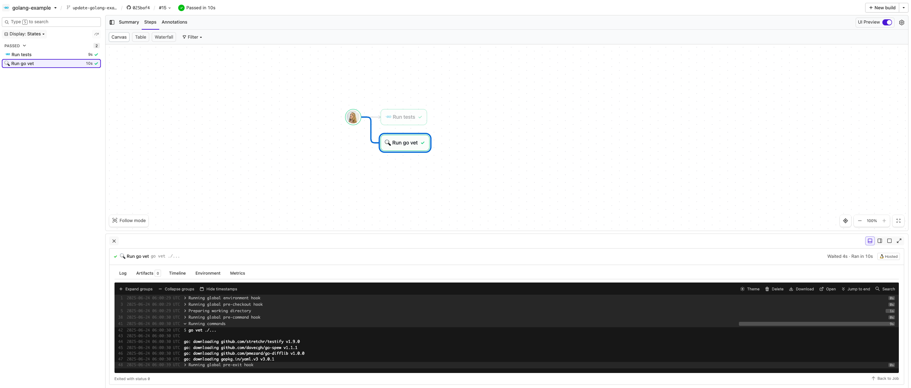

# Buildkite Golang Example

This repository is an example [Buildkite](https://buildkite.com/) pipeline that runs and tests a [Golang](https://go.dev) project **without using Docker**.

👉 **See this example in action:** [buildkite/golang-example](https://buildkite.com/buildkite/golang-example/builds/latest?branch=main)

See the full [Getting Started Guide](https://buildkite.com/docs/guides/getting-started) for step-by-step instructions on how to get this running, or try it yourself:

<!-- docs:start -->

## How it works

This example:
- Includes a basic main.go file that prints a message (tested via `main_test.go`)
- Uses Go’s built-in `testing` package with [Testify](https://github.com/stretchr/testify) for assertions.
- Runs `go test` and `go vet` via `.buildkite/pipeline.yml`
- Runs on a Buildkite-hosted agent with Go preinstalled (no Docker setup needed)

> 🐳 Interested in a Docker-based Go example instead?
> Check out [buildkite/golang-docker-example](https://github.com/buildkite/golang-docker-example)

## Requirements

- A Buildkite agent with Go installed
  _(or you can use a **Buildkite-hosted agent image with Go preinstalled**, like this repo does - no setup needed!)_
  See [Buildkite Hosted Agents](https://buildkite.com/docs/pipelines/hosted-agents) for details.

> 💡 In this example, the default queue is set in the Buildkite **Pipeline Settings → Steps** UI,
> so there's no need to specify it inside the `.buildkite/pipeline.yml` file.

<!-- docs:end -->

## License

See [LICENSE.md](LICENSE.md) (MIT)
