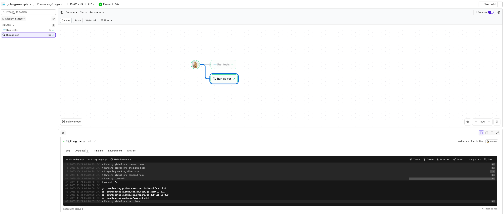

# Buildkite Golang Example

This repository is an example [Buildkite](https://buildkite.com/) pipeline that runs and tests a [Golang](https://go.dev) project **without using Docker**.

👉 **See this example in action:** [buildkite/golang-example](https://buildkite.com/buildkite/golang-example/builds/latest?branch=main)

See the full [Getting Started Guide](https://buildkite.com/docs/guides/getting-started) for step-by-step instructions on how to get this running, or try it yourself:

<!-- docs:start -->

## How it works

This example:
- Includes a basic main.go file that prints a message (tested via `main_test.go`)
- Uses Go’s built-in `testing` package with [Testify](https://github.com/stretchr/testify) for assertions.
- Runs `go test` and `go vet` via `.buildkite/pipeline.yml`
- Runs on a Buildkite-hosted agent with Go preinstalled (no Docker setup needed)
- Uses Buildkite Cache in the test step to reuse downloaded Go modules and compiled packages across builds.

> 🐳 Interested in a Docker-based Go example instead?
> Check out [buildkite/golang-docker-example](https://github.com/buildkite/golang-docker-example)

## Requirements

- A Buildkite agent with Go installed
  _(or you can use a **Buildkite-hosted agent image with Go preinstalled**, like this repo does - no setup needed!)_
  See [Buildkite Hosted Agents](https://buildkite.com/docs/pipelines/hosted-agents) for details.
- A clustered Buildkite agent running version **3.136.3 or later** for Buildkite Cache.
  Hosted agents receive a cache store automatically and use the cluster's default registry.
  Self-hosted agents need a [cache store and storage credentials](https://buildkite.com/docs/pipelines/configure/cache#set-up-buildkite-cache-self-hosted-agents).

> 💡 In this example, the default queue is set in the Buildkite **Pipeline Settings → Steps** UI,
> so there's no need to specify it inside the `.buildkite/pipeline.yml` file.

## Buildkite Cache

[`.buildkite/cache.yml`](.buildkite/cache.yml) defines one cache containing Go's
module download cache (`GOMODCACHE`) and compilation cache (`GOCACHE`). The test
step places both under `~/.cache/buildkite-golang-example`, restores before
`go test`, and saves after the tests pass. The independent `go vet` step is unchanged.
The `$$` escapes in the pipeline defer shell expansion until the job runs, rather
than evaluating variables on the agent that uploads the pipeline.

The cache key includes:

- `golang-example-v1`: a namespace and format version; bump it to start fresh.
- The pipeline and branch, so the cluster's default registry doesn't share this
  cache between copies of the example or between branches.
- The agent's OS and architecture, and the actual Go toolchain version.
- A checksum of `go.mod`, `go.sum`, and Go source files, so dependency and source
  changes can save a new entry instead of leaving an older compilation cache unchanged.

`fallback_limit` keeps the namespace, pipeline, branch, platform, and Go version
mandatory but allows restoring an older dependency/source snapshot. Go still
resolves required modules and validates its compilation cache, downloading or
rebuilding anything missing or changed. A cache miss also works: the tests populate
both directories from scratch. This example assumes Go targets the agent's native
platform.

To verify it on Buildkite, run the pipeline twice on clean hosted agents with the
same commit and Go version. Check the first run's restore/save logs, then confirm
the second run reports an **exact cache hit** and passes the tests. A new key
namespace can ensure the first run is a miss. Don't rely on directories left by a
previous job as evidence of a restore.

See the [Buildkite Cache documentation](https://buildkite.com/docs/pipelines/configure/cache)
for setup, key matching, and registry policies. Before accepting untrusted builds,
configure registry policies so they cannot save caches that trusted builds restore;
cache keys are not an access-control boundary. Cache only regenerable data, never
credentials or secrets.

<!-- docs:end -->

## License

See [LICENSE.md](LICENSE.md) (MIT)
