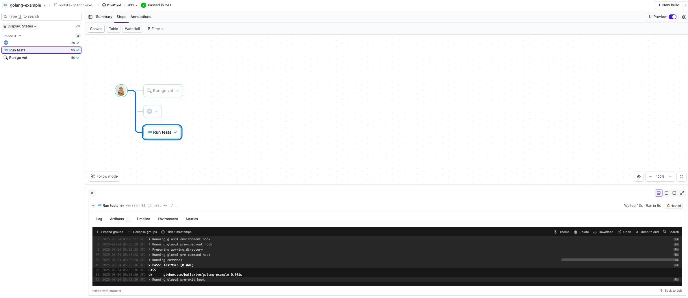

# Buildkite Golang Example
[](https://buildkite.com/buildkite/golang-example)

This repository is an example of testing a [Golang](https://go.dev) project using [Buildkite](https://buildkite.com), **without using Docker**.

👉 **Live Pipeline:** [buildkite.com/buildkite/golang-example](https://buildkite.com/buildkite/golang-example)

See the full [Getting Started Guide](https://buildkite.com/docs/guides/getting-started) for step-by-step instructions on how to get this running, or [Add to Buildkite](https://buildkite.com/new) to try it yourself.

[](https://buildkite.com/new)

## How it works

This example:
- Includes a basic main.go file that prints a message (tested via `main_test.go`)
- Uses Go’s built-in `testing` package with [Testify](https://github.com/stretchr/testify) for assertions.
- Includes a `.buildkite/pipeline.yml` that runs `go test` and `go vet`.
- Uses a Buildkite-hosted agent with Go preinstalled (via a custom image).

<a href="https://buildkite.com/buildkite/golang-example/builds?branch=main">
  
</a>

> 🐳 Interested in a Docker-based Go example instead?
> Check out [buildkite/golang-docker-example](https://github.com/buildkite/golang-docker-example)

## Requirements

- A Buildkite agent with Go installed
  _(or you can use a **Buildkite-hosted agent image with Go preinstalled**, like this repo does — no setup needed!)_
  See [Buildkite Hosted Agents](https://buildkite.com/docs/pipelines/hosted-agents) for details.

> 💡 In this example, the default queue is set in the Buildkite **Pipeline Settings → Steps** UI,
> so there's no need to specify it inside the `.buildkite/pipeline.yml` file.


## To try it yourself

Clone the repo and run:

```bash
go test ./...

# Or run the program directly:
go run .

```

## License

See [Licence.md](Licence.md) (MIT)
